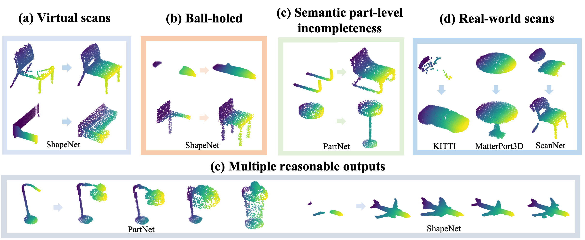

# ShapeInversion

## Credits for Original ShapeInversion Paper
Junzhe Zhang, Xinyi Chen, Zhongang Cai, Liang Pan, Haiyu Zhao, Shuai Yi, Chai Kiat Yeo, Bo Dai, Chen Change Loy "Unsupervised 3D Shape Completion through GAN Inversion" CVPR 2021
* Project page: [link](https://junzhezhang.github.io/projects/ShapeInversion/)
* Paper: [link](https://arxiv.org/abs/2104.13366)

## Modified Version of Code for Multiclass ShapeInversion
Nanyang Technological University Final Year Project: FYP-SCSE21-0204.
Title: Experimental Investigation of Multiclass 3D Point Cloud Completion.
Project Duration: August 2021 - April 2022
Student: Lee Wei Zheng Benedict, email: benedictlee21@gmail.com
Supervisor: Associate Professor Chen Change Loy
Co-supervisor: Mr. Zhang Junzhe

#### Example Multiclass Models and Completed Shapes
The link: https://1drv.ms/u/s!ArtutqAbB5xljbBk3vf7u-SeKcGWCg?e=G1xJfS can be used to access: 
1. The CRN datasets required for ShapeInversion.
2. 8 samples of multiclass models using a conditional GAN, pretrained using 8 different pairs of classes.
3. 8 samples of multiclass models without using a conditional GAN, pretrained using 8 different pairs of classes.
4. 8 samples of baseline pre-statistics files of for evaluating the 8 pairs of multiclass models.
5. Samples of multiclass shapes completed using those multiclass models (with and without conditional GAN).

**'Iteration 1'** zip files for both CGAN and no CGAN results contain the follwoing class pairs:
1. chair + table
2. couch + cabinet
3. lamp + car
4. plane + watercraft

**'Iteration 2'** zip files for both CGAN and no CGAN results contain the follwoing class pairs:
1. table + couch
2. lamp + cabinet
3. chair + watercraft
4. car + plane

## Multiclass Using Conditional GAN

#### Training of Multiclass Model
**Specify at least 2 classes to train the multiclass model on.**
More than 2 classes can be selected but this may lead to instability or failure of the GAN to converge.
Do note that the training time increases proportionally to the number of classes chosen and the number of samples per class used.
Batch size may be adjusted to suit the memory capabilities of the GPU being used.
```
python pretrain_treegan.py \
--split train \
--class_choice multiclass \
--FPD_path <path to FPD statistics file for class pair A and B> \
--ckpt_path <path to pretrained multiclass model> \
--dataset_path <path to dataset> \
--class_range <class A>,<class B> \
--knn_loss True \
--conditional_gan True \
--epochs 1000 \
--batch_size 4 \
--samples_per_class 1000 \
--eval_every_n_epoch 100 \
--save_every_n_epoch 100
```

#### Evaluation of Multiclass Model
**Specify the same classes that were used to train the particular multiclass model.**
No ground truths are used.
First generate the pre-statistics file for each set of classes used before evaluating the multiclass model using those same classes.
```
python eval_treegan.py \
--split train \
--eval_treegan_mode generate_fpd_stats \
--class_choice multiclass \
--save_sample_path <path to save samples to> \
--model_pathname <path to pretrained multiclass model> \
--dataset_path <path to dataset> \
--class_range <class A>,<class B>
```

Next compute the FPD metric for the multiclass model.
```
python eval_treegan.py \
--eval_treegan_mode FPD \
--class_choice multiclass \
--conditional_gan True \
--FPD_path <path to FPD statistics file for class pair A and B> \
--save_sample_path <path to save samples to> \
--model_pathname <path to pretrained multiclass model> \
--dataset_path <path to dataset> \
--class_range <class A>,<class B>
```

#### Testing of Multiclass Model
**Specify only one of the classes that was used to train the multiclass model.**
(I.e. If classes 'A' and 'B' were used to train the multiclass model, specify either class 'A' or 'B' for shape completion, but not both.)
```
python trainer.py \
--dataset CRN \
--class_choice multiclass \
--inversion_mode multiclass \
--conditional_gan True \
--visualize \
--mask_type k_mask \
--save_inversion_path <path to save completed shapes> \
--ckpt_load <path to pretrained multiclass model> \
--dataset_path <path to dataset> \
--class_range <class A>,<class B>
```

#### Evaluation of Completed Shapes
Evaluation of shapes completed using the multiclass models according to their specified classes is carried out in the same way as that of single class, but they do not use the ground truths.
```
python eval_multiclass_completion.py \
--saved_results_path <path to saved results>
```

## Multiclass Without Conditional GAN (Not Recommended)
Multiclass without using a conditional GAN is not recommended as the completed shapes are usually fixed to a single class outcome as inferred by the model, even when there are multiple possible class outcomes.

#### Training of Multiclass Model
**Specify 2 at least classes to train the multiclass model on.**
More than 2 classes can be selected but this may lead to instability or failure of the GAN to converge.
Do note that the training time increases proportionally to the number of classes chosen and the number of samples per class used.
Batch size may be adjusted to suit the memory or computational capabilities of the GPU being used.
```
python pretrain_treegan.py \
--split train \
--class_choice multiclass \
--FPD_path <path to FPD statistics file for class pair A and B> \
--ckpt_path <path to pretrained multiclass model> \
--dataset_path <path to dataset> \
--class_range <class A>,<class B> \
--knn_loss True \
--conditional_gan True \
--epochs 1000 \
--batch_size 4 \
--samples_per_class 1000 \
--eval_every_n_epoch 100 \
--save_every_n_epoch 100
```

#### Evaluation of Multiclass Model
**Specify the same classes that were used to train the particular multiclass model.**
No ground truths are used.
First generate the pre-statistics file for each set of classes used before evaluating the multiclass model using those same classes.
```
python eval_treegan.py \
--split train \
--eval_treegan_mode generate_fpd_stats \
--class_choice multiclass \
--save_sample_path <path to save samples to> \
--model_pathname <path to pretrained multiclass model> \
--dataset_path <path to dataset> \
--class_range <class A>,<class B>
```

Next compute the FPD metric for the multiclass model.
```
python eval_treegan.py \
--eval_treegan_mode FPD \
--class_choice multiclass \
--conditional_gan False \
--FPD_path <path to FPD statistics file for class pair A and B> \
--save_sample_path <path to save samples to> \
--model_pathname <path to pretrained multiclass model> \
--dataset_path <path to dataset> \
--class_range <class A>,<class B>
```

#### Testing of Multiclass Model
**Specify only one of the classes that was used to train the multiclass model.**
(I.e. If classes 'A' and 'B' were used to train the multiclass model, specify either class 'A' or 'B' for shape completion, but not both.)
```
python trainer.py \
--dataset CRN \
--class_choice multiclass \
--inversion_mode multiclass \
--conditional_gan True \
--visualize \
--mask_type k_mask \
--save_inversion_path <path to save completed shapes> \
--ckpt_load <path to pretrained multiclass model> \
--dataset_path <path to dataset> \
--class_range <class A>,<class B>
```

#### Evaluation of Completed Shapes
Evaluation of shapes completed using the multiclass models according to their specified classes is carried out in the same way as that of single class, but they do not use the ground truths.
```
python eval_multiclass_completion.py \
--saved_results_path <path to saved results>
```

## Credits for Original ShapeInversion Paper
Junzhe Zhang, Xinyi Chen, Zhongang Cai, Liang Pan, Haiyu Zhao, Shuai Yi, Chai Kiat Yeo, Bo Dai, Chen Change Loy "Unsupervised 3D Shape Completion through GAN Inversion" CVPR 2021
* Project page: [link](https://junzhezhang.github.io/projects/ShapeInversion/)
* Paper: [link](https://arxiv.org/abs/2104.13366)

## Results


## Setup
### Environment
```
conda create -n shapeinversion python=3.7
conda activate shapeinversion
pip install torch==1.2.0 torchvision==0.4.0
pip install plyfile h5py Ninja matplotlib scipy
```
### Datasets
Our work is extensively evaluated with several existing datasets. For the virtual scan benchmark (derived from ShapeNet), we use [CRN's dataset](https://drive.google.com/file/d/1MzVZLhXOgfaLZjn1jDrwuiCB-XCfaB-w/view?usp=sharing). We would suggest you to get started with this dataset. For ball-holed partial shapes, we refer to [PF-Net](https://github.com/zztianzz/PF-Net-Point-Fractal-Network). For PartNet dataset, we download from [MPC](https://github.com/ChrisWu1997/Multimodal-Shape-Completion). For real scans processed from KITTI, MatterPort3D, and ScanNet, we get from [pcl2pcl](https://github.com/xuelin-chen/pcl2pcl-gan-pub).

## Get started
We provide pretrained tree-GAN models for you to directly start with the inversion stage. You can download them from [Google drive](https://drive.google.com/drive/folders/1FA29POuh5hlg50ulCxSMjCImbgI6wxvR) or [Baidu cloud](https://pan.baidu.com/s/1VkRSHuS8hpbcXPzvnN1LfQ) (password: w1n9), and put them to the `pretrained_models` folder.

### Shape completion 
You can specify other class and other datasets, like real scans provided by pcl2pcl.
Dataset directory is a user specified directory that contains the input partial shapes as well as any ground truths corresponding to those input partial shapes.
```
python trainer.py \
--dataset CRN \
--class_choice chair \
--inversion_mode completion \
--mask_type k_mask \
--save_inversion_path ./saved_results/CRN_chair \
--ckpt_load pretrained_models/chair.pt \
--dataset_path <your_dataset_directory>
```
### Evaluating completion results
For datasets with GT, such as the above `CRN_chair`:
```
python eval_completion.py \
--eval_with_GT true \
--saved_results_path saved_results/CRN_chair
```
For datasets without GT:
```
python eval_completion.py \
--eval_with_GT false \
--saved_results_path <your_results_on_KITTI>
```
### Giving multiple valid outputs
ShapeInversion is able to provide multiple valid complete shapes, especially when extreme incompleteness that causes ambiguity.
```
python trainer.py \
--dataset CRN \
--class_choice chair \
--inversion_mode diversity \
--save_inversion_path ./saved_results/CRN_chair_diversity \
--ckpt_load pretrained_models/chair.pt \
--dataset_path <your_dataset_directory>
```
### Shape jittering
ShapeInversion is able to change an object into other plausible shapes of different geometries.
```
python trainer.py \
--dataset CRN \
--class_choice plane \
--save_inversion_path ./saved_results/CRN_plane_jittering  \
--ckpt_load pretrained_models/plane.pt \
--inversion_mode jittering \
--iterations 30 30 30 30 \
--dataset_path <your_dataset_directory>
```
### Shape morphing
ShapeInversion enables morphing between two shapes.
```
python trainer.py \
--dataset CRN \
--class_choice chair \
--save_inversion_path ./saved_results/CRN_chair_morphing  \
--ckpt_load pretrained_models/chair.pt \
--inversion_mode morphing \
--dataset_path <your_dataset_directory>
```
### Pretraining
You can also pretrain tree-GAN by yourself.
```
python pretrain_treegan.py \
--split train \
--class_choice chair \
--FPD_path ./evaluation/pre_statistics_chair.npz \
--ckpt_path ./pretrain_checkpoints/chair \
--knn_loss True \
--dataset_path <your_dataset_directory>
```
NOTE:
- The inversion stage supports distributed training by simply adding `--dist`. It is tested on [slurm](https://slurm.schedmd.com/) as well.
- The hyperparameters provided may not be optimal, feel free to tune them.
- Smaller batch size for pretraining is totally fine.

# Acknowledgement
The code is in part built on [tree-GAN]() and [DGP](https://github.com/XingangPan/deep-generative-prior). Besides, CD and EMD are borrowed from [ChamferDistancePytorch](https://github.com/ThibaultGROUEIX/ChamferDistancePytorch) and [MSN](https://github.com/Colin97/MSN-Point-Cloud-Completion) respectively, both of which are included in the `external` folder for convenience.

## Citation
```  
@inproceedings{zhang2021unsupervised,
    title = {Unsupervised 3D Shape Completion through GAN Inversion},
    author = {Zhang, Junzhe and Chen, Xinyi and Cai, Zhongang and Pan, Liang and Zhao, Haiyu 
    and Yi, Shuai and Yeo, Chai Kiat and Dai, Bo and Loy, Chen Change},
    booktitle = {CVPR},
    year = {2021}}
